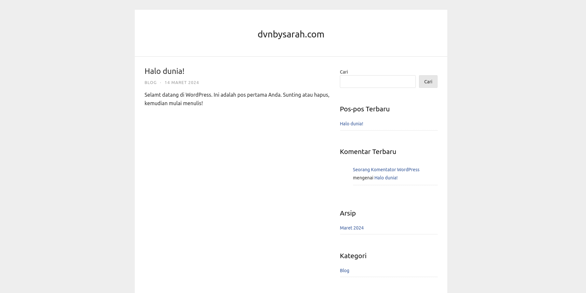

# Html-Clones

## Task

Design an algorithm that will group together HTML documents which are similar from the perspective of a user who opens them in a web browser.

## Content Length Clustering

This first approach was based on the ideea that clones generally have the same content, with minimal modifications. With the use of a `HTML Parsing` library, the algorithm extracts the text content from relevant tags (<a\>, <p\>, <h1\>, and so on). Then we simply calculate the length of this content for each page and group pages with simillar content lengths (where their difference is less than 15%).

## Visualization

Opening each html page by hand can get really inefficient really fast. Therefore, I decided to write some code that takes a screenshot of each website and saves it in its respective group folder. For this I used a library called `Selenium` which creates a web browser, runs the html in this browser, and finally takes a screenshot of the page.

|  |
| :---------------------------------------------------: |
|    _Selenium screenshot of one of the html pages_     |

Some pages have a \<script\> tag that prevents the site from loading (e.g. a while loop that refreshes the window). In such cases, the user would not be able to view the site either, so the visualization algorithm skips any page that doesn't load in a specified amount of time.

|                      |
| :-----------------------------------------------------------: |
| _Terminal output with progress, benchmark, and error logging_ |

## First Results

The first algorithm, though naive, works surprisingly well. Similar looking websites tend to be grouped together, but group folder may contain two or more types of pages. Further refinement is needed due to 2 major reasons:

- Pages can have similar content lengths, but have entirely different content
- Pages can have very different styling, which I would argue makes them not be clones

With that being said, the algorithm does a decent job at grouping the html clones and it is extremely fast. Most processing runs in linear time and there is one list sorting that has **O(n \* log n)** time complexity, where n is the number of pages in each tier.

|  |
| :--------------------------------------------------------: |
|            _Screenshots for one of the groups_             |

## Image Similarity

Since have already written the Selenium screenshot code, we can try clasifying the html pages by how similar these images are. Since the website render matches the perspective of the user, we could spot differences between differently styled pages:

|  |  |
| :--------------------------------------------------------------: | :-----------------------------------------------------: |
|                        _Simple html page_                        |                   _Styled html page_                    |

How should we go about comparing these two images? For one, we shouldn't calculate their difference pixel by pixel since even the smallest of offsets would throw our calculations off balance. We could use more sophisticated computer vision algorithms, but we are dealing with a simple and structured html page after all. I decided to split each image into 10 x 10 pixel squares and take the **average** color in these regions. Then, if we calculate the **mean square error** for two images, we get a good approximation for the difference between two images. Finally, we can group the images that have this difference smaller than a set amount. Of course, we also have to keep track of which pages timed out.

This algorithm is, however, way more expensive to run. In the worst case, it needs to compare every image with every other image. This result in **O(n ^ 2 \* image_size)** time complexity. The other, much worse, issue with this second solution is how much memory it consumes. In its current implementation, the 1.00GB heap gets full in a matter of seconds, halting the algorithm.

## Scalability

In Scala, we can easily improve scalability by using `lazy evaluation` in terms of **LazyList**. When working large amounts of data, we can avoid unnecessary computation and reduce memory usage.

In this case, we would not want to hold a list with all of the parsed html files in memory. We would like to take a single file, process it, free any memory no longer needed, and then finally move on to the next file. By using a lazy list, we can achieve a similar behaviour while still writing the code in a nice, easy to read, `functional` style.

Another idea here is to take advantage of `parallelism`, using multiple threads for processing the list of files in the target directory. Scala offers effortless `concurrency` through **Futures**. The clustering algorithm parses the html and calculates the length of the content in such a list of futures, that are then joined and awaited.

The code that uses Selenium to screenshot each html page benefits significantly from multithreading. We have multiple web drivers that are stored in a **LinkedBlockingQueue** and, with the use of the **ExecutionContext** and a **ThreadPool**, we can process each group inside a Future that has concurrent access to exactly one resource (a web driver). With sequential processing this code runs in 52.4 seconds, while by using 4 threads we cut that time down to 22.0 seconds. That is a **2.3x improvement** and I believe this number will only increase when working with larger amounts of data.

## Conclusion

When I began this task, I had limited experience with Scala and data engineering. However, this challenge turned out to be incredibly enjoyable! It provided me with the opportunity to dive into a new programming language and apply concepts like concurrency and lazy evaluation in a practical project. While the underlying algorithms were relatively simple, I’m proud of how the project evolved—both in terms of the code’s structure and the performance of the first algorithm.
